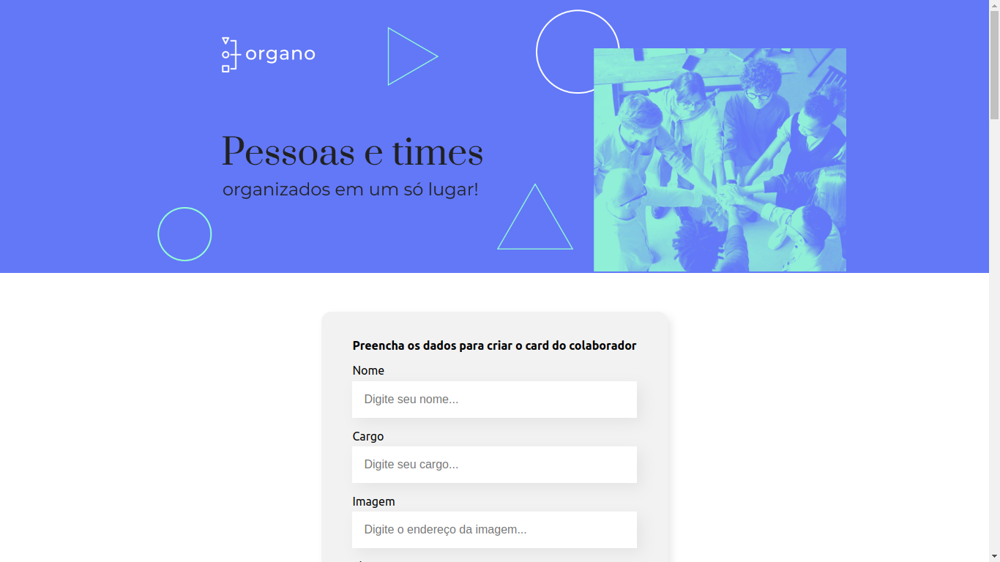

# Organo

<h2 align="center"><a href="https://organo-ten-lyart.vercel.app/">Clique para visitar o projeto</a></h2>

> Organo é um site onde se pode organizar os membros de algum grupo.

### O que aprendi ao fazer o projeto: 

- [x] Vantagens da utilização do React
- [x] Implementar componentes reativos
- [x] Investigar e analisar mensagens de erro
- [x] Modificar e evoluir componentes de acordo com a necessidade do projeto

[⬆ Voltar ao topo](#Organo) 
